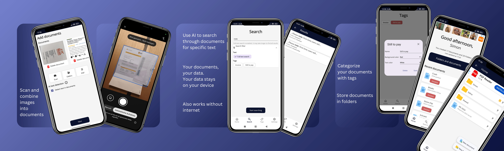

{}

<!--
  Want a cover without an image?
  Add the following argument to the blocks/cover shortcode:
    color="primary bg-gradient td-below-navbar"
-->

Verwalte deine Dokumente mit Athena. Einfach, sicher und ohne Registrierung.

Erstelle PDFs aus Dokumenten und Bildern und durchsuche deine Unterlagen nach wichtigen Informationen - komplett ohne Internetverbindung. 

Und das beste daran? Deine Daten verlassen niemals dein Handy.
<!-- prettier-ignore -->
{}
{.display-6}

<!-- prettier-ignore -->
<!--

  <a {} href="docs/">
    GET IT ON GOOGLE PLAY
  </a>
  <a {}
    href="{}"
    target="_blank" rel="noopener noreferrer">
    Get the code
    {}
  </a>

-->

{}

{}

{}

{}
 {}

Warum Athena?

{}

{}

{}

Athena ist kostenlos. Es ist keine Registierung oder Abo erforderlich.

{}

{}

Athena respektiert deine Privatsphäre. Alle Informationen und Dokumente bleiben auf deinem Gerät. Du hast die komplette Kontrolle über deine Daten.

{}

{}

Athena funktioniert komplett ohne Internetverbindung.

{}

{}

{}

Du brauchst noch mehr Informationen?

{}

{}

{}

Was ist in den nächsten Versionen geplant?

{}

{}

Informationen über die aktuellste Version

{}

{}

Was hat sich geändert?

{}

{}

Wie benutzt man Athena?

{}

{}

Melde Probleme, schlage neue Features vor oder stelle eine generelle Frage über Athena

{}

{}

Kontakt für generelle Fragen - nicht auf Athena bezogen

{}

{}
